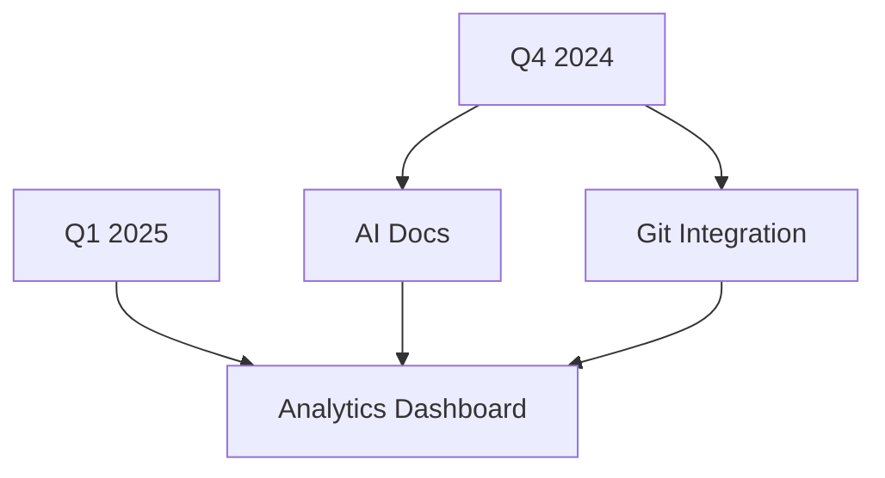

## Recent Updates

Stay informed about the latest releases. You receive notifications for new versions through your dashboard at `https://dashboard.example.com`. Check the tags to quickly identify the impact of each release.

<Update label="2024-10-15" description="v1.2.0" tags={["feature", "improvement"]}>

## New Features

- Added real-time collaboration support for documentation editing, allowing multiple users to work simultaneously.
- Introduced customizable brand colors, including support for `#3B82F6` as the default blue theme.

## Improvements

- Enhanced search functionality with fuzzy matching for faster topic discovery.
- Optimized page load times by `>30%` through improved asset bundling.

## Bug Fixes

- Fixed rendering issues with nested code blocks in MDX files.
- Resolved authentication errors during webhook callbacks.

</Update>

<Update label="2024-09-20" description="v1.1.0" tags={["feature", "bugfix"]}>

## New Features

- Integrated Mermaid diagram support for flowcharts and sequence diagrams directly in docs.
- Added export options to PDF and Markdown formats.

## Bug Fixes

- Corrected parsing errors in YAML frontmatter with special characters.
- Patched security vulnerability in API token handling.

</Update>

<Update label="2024-08-10" description="v1.0.0" tags={["breaking", "feature"]}>

## Breaking Changes

- Updated API endpoint from `/v1/docs` to `/v2/docs` for better versioning.

## New Features

- Core documentation management with MDX support.
- User authentication via `https://auth.example.com`.

## Initial Setup

- Basic dashboard at `https://dashboard.example.com`.

</Update>

<Callout kind="tip">
Subscribe to updates via webhook at `https://your-webhook-url.com/webhook` to get instant notifications.
</Callout>

## Upgrade Instructions

Follow these steps to upgrade to the latest version.

<Steps>
  <Step title="Backup Your Data" icon="database">
    Export your current documentation:
    
````bash
shxian-cli export --output backup.json
````
  </Step>
  <Step title="Update Package" icon="download">
    <CodeGroup tabs="npm,yarn">
````bash
npm install shxian-qiu@latest
````
````bash
yarn add shxian-qiu@latest
````
    </CodeGroup>
  </Step>
  <Step title="Run Migrations" icon="settings">
    
````bash
shxian-cli migrate --version 1.2.0
````

    Review any breaking changes listed above.
  </Step>
  <Step title="Verify" icon="check-circle">
    Test your docs at `https://docs.example.com`.
  </Step>
</Steps>

## Upcoming Roadmap

Explore planned enhancements. Provide feedback on GitHub.

<Columns cols={3}>
  <Card title="AI Assistance" icon="zap" href="https://github.com/shxianqiu/issues/42">
    Auto-generate docs from code comments.
  </Card>
  <Card title="Version Control" icon="git-branch" href="https://github.com/shxianqiu/issues/51">
    Full Git integration for doc history.
  </Card>
  <Card title="Analytics" icon="bar-chart-3" href="https://github.com/shxianqiu/issues/60">
    Track doc views and engagement.
  </Card>
</Columns>

<Expandable title="Detailed Roadmap Timeline" default-open="false">



</Expandable>